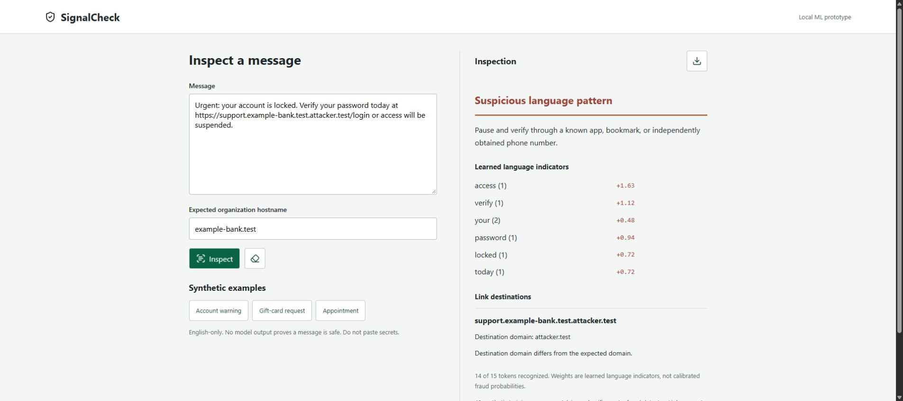

# SignalCheck

Fresh ForgeHacks 2026 AI + Cybersecurity candidate, created October 7. Not submitted.

An offline-first message inspection tool: a genuine trained Multinomial Naive Bayes model identifies English language patterns, while independent hostname parsing highlights destination mismatches, embedded credentials, IP addresses and internationalized hostnames. Messages stay in browser memory. No URL is visited. No paid service, account, key, model download or external API is required.

## Run

Requires Node 22+ and npm. From this directory:

```powershell
$env:npm_config_cache = Join-Path (Get-Location) '.cache/npm'
npm ci --ignore-scripts --no-audit --no-fund
npm run build
npm test
npm run evaluate
npm start
```

Open http://127.0.0.1:3274. If occupied, set SIGNALCHECK_PORT to an unused port. The server binds loopback only. Runtime inference is entirely in the browser; network access is required only to install dependencies. Clear removes the displayed message/report; reload discards all input. This is not cryptographic memory erasure. Do not paste passwords, codes or sensitive personal messages. Exports omit raw message text and URL paths/queries/credentials, but still include recognized words and hostnames: review before sharing.

## AI and Evaluation

ml-naivebayes 4.0.0 trains a real MultinomialNB from 40 author-created, synthetic English messages at application startup. It learns smoothed token likelihoods; it does not use fixed canned prediction outputs. A test reverses training labels and verifies predictions change. The domain checks are independent deterministic safeguards, not ML. Training and 16-message held-out sets are distinct, but both were hand-written by the same author. `npm run evaluate` prints exact confusion counts, all errors, abstentions and a keyword baseline. No real-world accuracy, user study, benchmark validity or deployment claim is made.

Unfamiliar messages with fewer than three recognized tokens abstain. The model is small and sensitive to training wording, negation, synonyms, multilingual text and intentional evasion. It cannot authenticate a sender, detect AI-generated text, investigate a domain, identify malware or declare fraud. No outcome is labeled safe. Recognition counts/weights are NOT calibrated probabilities. Sensitive requests always require verification through a known independent channel.

## Privacy and Boundaries

The server serves only three fixed resources and refuses mutation routes and foreign Host headers. CSP blocks browser network connections and injected scripts/styles. Message output uses textContent, not innerHTML. No storage, analytics, cookies, outbound requests, customer messaging, payments or automatic blocking. HTTP(S) links only; other schemes/plain-domain links and attachments are not scanned. Domain comparison uses the Public Suffix List via tldts, including private suffixes. A matching domain is not proof of authenticity.

## Event Work and Demo

Built October 7 during ForgeHacks 2026 and continued in the same original project. No earlier submitted entry was reused. AI coding assistance: Codex. Project ML: ml-naivebayes, separate from coding assistance. No real users, real-world accuracy or production deployment claim.

The local demo is a 3:10 walkthrough of five actual captured app states with synthetic narration, not a continuous recording. It includes the model's negation false positive. Public video URL is pending publication approval; no submission is claimed. Browser export download transport and true mobile viewport verification are unconfirmed.



## Prebuilt Runtime

The supplied public/bundle.mjs is the tested esbuild output. Run node server.mjs without installing dependencies for the prebuilt runtime. Rebuilding/testing requires npm ci and the commands above. THIRD-PARTY-NOTICES.txt preserves bundled dependency licenses.
